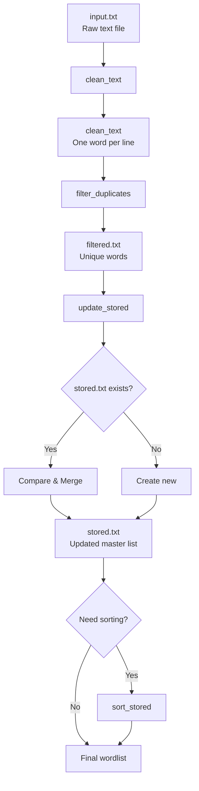

# Find Words

A lightweight C++ toolkit for building and maintaining clean, deduplicated word lists from raw text. Perfect for search engines, and linguistic research.

[](https://opensource.org/licenses/MIT)
[](https://isocpp.org/)
[](https://en.wikipedia.org/wiki/Portability)

##  Table of Contents
- [Overview](#-overview)
- [Features](#-features)
- [Workflow](#-workflow)
- [Installation](#-installation)
- [Usage](#-usage)
- [Build System](#-build-system)
- [Future Roadmap](#-future-roadmap)
- [Contributing](#-contributing)
- [License](#-license)

##  Overview

Wordlist Manager processes raw text files into clean, deduplicated word lists. It's designed for incremental updates, allowing you to maintain a growing master dictionary without manual cleanup. The toolkit is modular, efficient, and ideal for building custom word lists for various applications.

##  Features

| Utility | Purpose | Input | Output |
|---------|---------|-------|--------|
| **clean_text** | Removes special characters, normalizes text | `input.txt` | `clean_text` |
| **filter_duplicates** | Removes duplicate words | `clean_text` | `filtered.txt` |
| **update_stored** | Merges new words into master list | `filtered.txt`, `stored.txt` | `stored.txt` (updated) |
| **sort_stored** | Alphabetically sorts word list | `stored.txt` | `stored.txt` (sorted) |

##  Workflow



### Typical Usage Flow:
1. **Prepare**: Place raw text in `input.txt`
2. **Clean**: Run `./clean_text` → creates `clean_text` file
3. **Deduplicate**: Run `./filter_duplicates` → creates `filtered.txt`
4. **Update**: Run `./update_stored` → merges new words into `stored.txt`
5. **(Optional)**: Run `./sort_stored` to alphabetize `stored.txt`

##  Installation

### Prerequisites
- GCC/G++ compiler (C++17 compatible)
- GNU Make
- Linux, macOS, or WSL (Windows Subsystem for Linux)

### Building from Source
```bash
# Clone the repository
git clone https://github.com/yourusername/wordlist-manager.git
cd wordlist-manager

# Compile all utilities
make

# Verify build
ls -la clean_text filter_duplicates update_stored sort_stored
```

### Cleaning Build Files
```bash
# Remove compiled binaries and intermediate files
make clean
```

##  Usage

### Basic Pipeline
```bash
# 1. Prepare your input
echo "Hello world! Hello again. Testing 1, 2, 3." > input.txt

# 2. Run the full pipeline
./clean_text
./filter_duplicates
./update_stored

# 3. Check results
cat stored.txt
```

### Output Example
**input.txt:**
```
Hello world! Testing... Testing 1, 2, 3. Hello again!
```

**stored.txt:**
```
Hello
world
Testing
1
2
3
again
```

### Incremental Updates
The real power comes from repeated use:
```bash
# Add more text to input.txt
echo "New words: algorithm, blockchain, cryptocurrency" >> input.txt

# Run pipeline again - only new words get added
./clean_text
./filter_duplicates
./update_stored

# stored.txt now contains original words + new unique words
```

##  Build System

The `Makefile` provides the following targets:

| Target | Description |
|--------|-------------|
| `make` / `make all` | Compiles all four utilities |
| `make clean_text` | Compiles only the text cleaner |
| `make filter_duplicates` | Compiles only the duplicate filter |
| `make update_stored` | Compiles only the update utility |
| `make sort_stored` | Compiles only the sorting utility |
| `make clean` | Removes all compiled binaries |

### Compilation Details
- Each utility compiles to a standalone binary
- No external dependencies required
- Optimized with `-O2` flag for performance
- C++17 standard for modern features

## 🗺️ Future Roadmap

### Phase 1: Code Quality & Stability (Next Release)
-  **Refactor** monolithic .cpp files into modular functions
-  **Add comprehensive error handling** for file operations
-  **Implement unit tests** for each processing stage
-  **Optimize performance** with buffer-based I/O for large files
-  **Enhance memory safety** and eliminate edge-case crashes

### Phase 2: Logging & Debug Support
-  **Verbose mode** (`--verbose` flag) for detailed processing info
-  **Debug mode** for troubleshooting text processing issues
-  **Colored terminal output** for better readability
-  **Progress indicators** for large file processing

### Phase 3: Enhanced Features (Planned)
- **Multilingual support** with Unicode character handling
- **Stemming/Lemmatization** options for word normalization
- **Frequency counting** to track word usage
- **Configurable filters** for excluding specific word patterns
- **Batch processing** for multiple input files
- **Docker containerization** for easy deployment

### Phase 4: Integration & Distribution
- **Package manager support** (Homebrew, apt, yum)
- **Python bindings** for use in NLP pipelines
- **Web interface** for non-technical users
- **Plugin system** for custom text processors

##  Contributing

Contributions are welcome! Here's how to help:

1. **Report Bugs**: Open an issue with detailed reproduction steps
2. **Suggest Features**: Share your ideas for improvements
3. **Submit Code**: 
   - Fork the repository
   - Create a feature branch
   - Add tests for new functionality
   - Submit a pull request

### Development Setup
```bash
# Clone with submodules (if any)
git clone --recursive https://github.com/yourusername/wordlist-manager.git

# Create a development branch
git checkout -b feature/your-feature-name

# Make changes, then test
make clean && make
./run_tests.sh  # Future test suite

# Commit and push
git commit -m "Description of changes"
git push origin feature/your-feature-name
```

##  Acknowledgments

- Inspired by the need for clean word lists in NLP projects
- Built with simplicity and efficiency in mind
- Thanks to all contributors who help improve this tool

---

**Quick Start Recap:**
```bash
make
echo "Your text here" > input.txt
./clean_text && ./filter_duplicates && ./update_stored
cat stored.txt
```

For questions, issues, or suggestions, please open an issue on GitHub.
